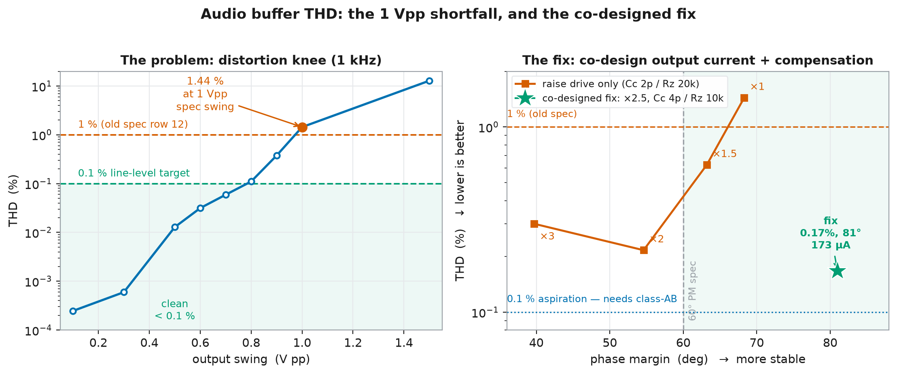

# analog-afe — the console's analog front-end

Own analog blocks for the [console](https://github.com/JoonatanAlanampa/console),
designed from device physics up on sky130 and simulated at transistor
level: **op-amp → comparator → SAR ADC**, plus the ring-oscillator clock
that comes over from the vertical-slice test structures.

This is the classic-EE leg of a full-stack goal whose other legs are
already standing — a calibrated
[device-physics/TCAD model](https://github.com/JoonatanAlanampa/devphys),
an [own standard-cell library](https://github.com/JoonatanAlanampa/stdcells)
that hardens a real design with zero foundry cells in the netlist, three
digital chips (one
[submitted to a shuttle](https://github.com/JoonatanAlanampa/CORDIC)),
and a hand-designed cartridge PCB. Analog is the part the digital chain
never makes you think about: biasing, matching, noise, offset, headroom.

**Status: phase 1 complete.** Phase 0 (spec, harness, two candidates, four
benches) is done and the topology **decision is made** — two-stage Miller for
the audio buffer, the 5T OTA kept for the high-Z comparator/SAR blocks
([`docs/topology-review.md`](docs/topology-review.md)). Phase-1
characterisation is **all in**: noise, PVT corners and CMRR (68.7 dB) pass;
THD was found **failing** at the 1 V pp spec swing (1.44 %) and is now
**fixed** — a co-designed output stage + compensation retune, corner-verified,
**8.6× better** ([see below](#the-gap-that-measurement-found--thd)) — the ICMR
bench pinned the residual-distortion floor to the input pair (not the output),
and a **constant-gm bias generator with a verified start-up** now replaces the
ideal current source ([`docs/biasgen.md`](docs/biasgen.md)). **Phase 2 (layout)
is under way** — the flow is stood up and the common-centroid input pair is
drawn, **routed, and LVS-clean** (it extracts to exactly the two-transistor
differential pair; [`docs/layout.md`](docs/layout.md)).

## The block under design

Not "an op-amp" — the console's **audio output buffer**. Today the
console makes sound with a sigma-delta bitstream and the cartridge Pmod's
external RC network and amplifier. The mixed-signal console replaces both
with silicon we designed:

    chiptune voices --> our DAC --> THIS BUFFER --> coupling cap --> jack

Everything in [`docs/spec.md`](docs/spec.md) is traced back to that job,
including which numbers are derivations and which are still guesses.

## Candidates

| | `spice/ota_5t.sp` | `spice/miller_ota.sp` |
|---|---|---|
| topology | 5-transistor OTA, single stage | two-stage, Miller + nulling resistor |
| input pair | NMOS (see below) | NMOS |
| load | PMOS mirror | PMOS mirror, then PMOS common-source |
| bias | 20 µA external into `vb` | 20 µA; output stage 3:1 → 60 µA |

`ota_5t` is also run as **`ota_5t_x5`** at 100 µA, so the comparison
answers "which topology", not "which bias current".

Both are hand-written netlists — no generator, no PCell library. Widths
are expressed as parallel `w = 5 µm` fingers so the netlist is
topologically what a layout would draw (the `stdcells` phase-6 lesson:
one entry per physical finger, and LVS needs no overrides).

## The finding that shaped both candidates

Both started with a **PMOS** input pair — the textbook choice, since the
sky130 pfet has the quieter flicker corner and audio is a flicker band.
It does not work at 1.8 V:

    V_tail = V_CM + |V_gs| = 0.9 + 0.88 = 1.78 V   ->   19 mV left for the tail

The tail source simulated in triode, delivering **3.87 µA of a requested
20 µA**. A unity-gain buffer forces its input common mode to its output,
and audio sits at mid-rail, so V_CM = 0.9 V is not negotiable — and a
PMOS pair's common-mode range tops out near 0.7 V.

The generalisation is the point: sky130's thresholds are ~0.63 V (nfet)
and ~0.9 V (pfet) against a 1.8 V rail — 35 % and 50 % of the supply.
**Headroom, not gain and not noise, is the first-order constraint of
every analog block on this process.** NMOS pairs fixed it (tail now
delivers 18.99 µA, every device saturated); the cost is the noisier
device in the audio band, which is why input-referred noise is an
explicit phase-1 bench rather than an afterthought.

That and the other dead ends are in
[`docs/design-notes.md`](docs/design-notes.md) — including a testbench
bug worth remembering: a resistive load modelled *without* its coupling
capacitor pulled the output to 0.196 V, which is just 20 µA × 10 kΩ. A
testbench that omits part of the real circuit doesn't measure a worse
version of it, it measures a different circuit.

## Benches

`tb/benches.py`, run over 3 candidates × 4 load corners:

| bench | measures |
|---|---|
| `op` | DC operating point, per-device `gm`/`gds`/`V_dsat` and **saturation margin**, supply current |
| `ac` | open-loop gain, gain at 20 kHz, UGF, phase margin, gain margin |
| `psrr` | supply rejection at DC / 1 kHz / 20 kHz (this die also holds a CPU and video timing) |
| `tran` | 100 mV step, unity gain: slew rate, 0.1 % settling, overshoot, gain error |

Load corners are the console's, not textbook round numbers: unloaded
(the amplifier's intrinsic gain), a line input behind the board's 47 µF
coupling cap (primary), the cartridge Pmod's RC network exactly as built
and DC-coupled, and a 32 Ω headphone (stretch). The unloaded corner is
what separates intrinsic gain from load-driven collapse — without it the
single-stage OTA just looks broken instead of drive-limited.

The open-loop AC bench closes the loop at DC through a 1 GH inductor and
injects through a 1 GF capacitor, so the amplifier is measured at the
operating point it actually runs at.

## Running it

Needs `ngspice` and the sky130 PDK; paths come from
`tb/common.py`, cribbed verbatim from `stdcells/flow/common.py`
(including the Windows 8.3 short-path conversion — ngspice's `.lib`
parser splits on spaces and this machine's home directory has one).

```sh
python tb/run.py                 # everything -> docs/results.md
python tb/run.py ac              # one bench
python tb/run.py ac miller_ota   # one bench, one candidate
```

```sh
python tb/sweep_comp.py          # Cc x Rz compensation sweep for miller_ota
python tb/sweep_comp.py line --report   # re-render from cached data
python tb/noise.py               # input-referred noise -> docs/noise.md
python tb/corners.py             # PVT corners + Monte Carlo offset -> docs/corners.md
python tb/thd.py                 # THD vs level / freq / topology / drive -> docs/thd.md
python tb/cmrr.py                # CMRR + ICMR (+ the ICMR/THD cross-check) -> docs/cmrr.md
python tb/biasgen.py             # constant-gm bias reference + start-up -> docs/biasgen.md
```

Results: [`docs/results.md`](docs/results.md),
[`docs/compensation.md`](docs/compensation.md),
[`docs/noise.md`](docs/noise.md), [`docs/corners.md`](docs/corners.md),
[`docs/thd.md`](docs/thd.md), [`docs/cmrr.md`](docs/cmrr.md) and
[`docs/biasgen.md`](docs/biasgen.md). Spec targets are asserted in `SPEC`
in `tb/run.py` and print PASS/FAIL per row.

## For the reviewer

[`docs/review-brief.md`](docs/review-brief.md) is the one-page version:
the comparison table, what the data says, and the calls it left open —
which the review then made in
[`docs/topology-review.md`](docs/topology-review.md) (two-stage Miller,
Cc 2 pF / Rz 20 kΩ, line-level only, series coupling cap mandatory).

The short version: the single-stage OTA is **drive**-limited, not
gain-limited — its 40 dB intrinsic gain collapses to 6.8 dB into a
10 kΩ AC load, and current-matching it at 100 µA only buys 11 dB, which
is what the `ota_5t_x5` variant exists to prove. The two-stage amp holds
56.8 dB into the same load at comparable current, with 0.115 % unity-gain
step error and 31 dB more PSRR. Nobody drives 32 Ω.

## A caveat that measurement refuted

The NMOS pair above was forced by headroom, and the honest cost stated
at the time was flicker noise — the NMOS being the noisier device in
exactly the band this circuit works in. Measured
([`noise.md`](noise.md)), that cost is **zero**:

| | input-referred, 20 Hz–20 kHz |
|---|---|
| NMOS pair (`ota_5t`) | 24.4 µV rms |
| PMOS pair (`ota_5t_pmos`, at its own valid 0.5 V CM) | **28.7 µV rms** |

Swapping the input pair also swaps which device is the *load*. With an
NMOS pair the pair dominates (76 % of output noise power); with a PMOS
pair the **NMOS mirror loads** dominate (73 %). sky130's NMOS flicker
noise carries ~75 % of the total either way — through the mirror it is
simply worse. All candidates land ~4× under spec at ~83 dB SNR against
a 1 V pp signal, so noise is not a risk here, and it does not
discriminate the two topologies (the entire second stage adds 0.4 %).

Bias current is not the lever either: 5× the current buys 1.6 µV,
because flicker scales with device *area*, not bias.

## The gap that measurement found — THD

Noise refuted a feared problem; THD found a real one — and fixing it is a
small design story in itself.



At the 1 V pp spec swing the as-built buffer is **1.44 %** THD
([`docs/thd.md`](docs/thd.md), left panel) — over both the old < 1 % row and
the review's 0.1 %. It is a clean line source only to ~0.75 V pp, then knees,
because the class-A output sink (61.5 µA — the same device behind the 2.6×
slew asymmetry) runs out of pull against the 50 µA the load demands.

Sizing the fix is the interesting part (right panel). Scaling the output
stage (a `pout` param) drops THD hard, but **reading phase margin beside it**
shows the ×1 compensation does not come along: more output gm2 was *expected*
to push the output pole out and help PM; instead the UGF rises and the margin
*falls*, because Rz = 20 kΩ is a lead/feedforward network, not pole-splitting.
So output current and compensation have to be co-designed. The search
(`tb/thd.py fix`, `tb/corners.py fix`) lands on:

> **×2.5 output, Cc 4 pF / Rz 10 kΩ → 0.167 % THD, 81° PM, 173 µA** — an
> **8.6× improvement**, corner-verified to PM ≥ 75.6° across process,
> −40…85 °C and ±10 % supply, inside the 200 µA budget and with *more* phase
> margin than the shipped design.

`Rz 20k → 10k` is the phase-margin lever (it cuts the feedforward that was
pushing the UGF up), `pout` is the THD lever. The last factor to 0.1 % turned
out **not** to be an output problem at all: the CMRR/ICMR bench
([`docs/cmrr.md`](docs/cmrr.md)) showed the fix's residual is the **input
pair** running out of common-mode range on the high half of the swing — it
triodes right at the 1.40 V peak of a 1 V pp output. THD at the fix collapses
to **0.0045 % at 0.4 V pp** (37× cleaner), so reaching 0.1 % at full swing
needs a wider-ICMR input, not more output current. At 0.167 % the buffer is
already ~35 dB quieter in distortion than 8-bit console audio can use. (CMRR
itself is 68.7 dB, flat across the band — a first-stage property the output
fix leaves untouched.)

## Phase 2 — layout (kicked off)

Post-layout is where analog designs go to die (matching, parasitics, wells),
so phase 2 starts with the hardest-to-get-right pieces. The flow — gdstk
device primitives → GDS → KLayout DRC (`sky130A_mr` deck) → rendered PNG — is
stood up in [`layout/`](layout/), reusing the `stdcells` KLayout + deck, and
the two structures that matter most are drawn **DRC-clean**:


The input pair is drawn **common-centroid** — interleaved fingers so devices A
and B share a centroid and a linear process gradient cancels to first order
(the matching a side-by-side layout can't get). It is then **routed into the
differential pair and LVS-matched** — five nets leave one diffusion strip on
two layers without a short, and the layout extracts to exactly two W=10 NMOS
with a common source:


Details and the routing scheme in [`docs/layout.md`](docs/layout.md).

**Next:** fold in dummies + the guard ring, then the full OTA + bias generator
→ post-extraction re-simulation. Two design items also carry in: the bias
generator's real poly resistor is a post-layout Monte-Carlo signoff item, and
a wider-ICMR input (rail-to-rail / complementary pair) is the path to THD
below 0.1 % at the full swing if ever wanted. Full roadmap in
[`PLAN.md`](PLAN.md).
