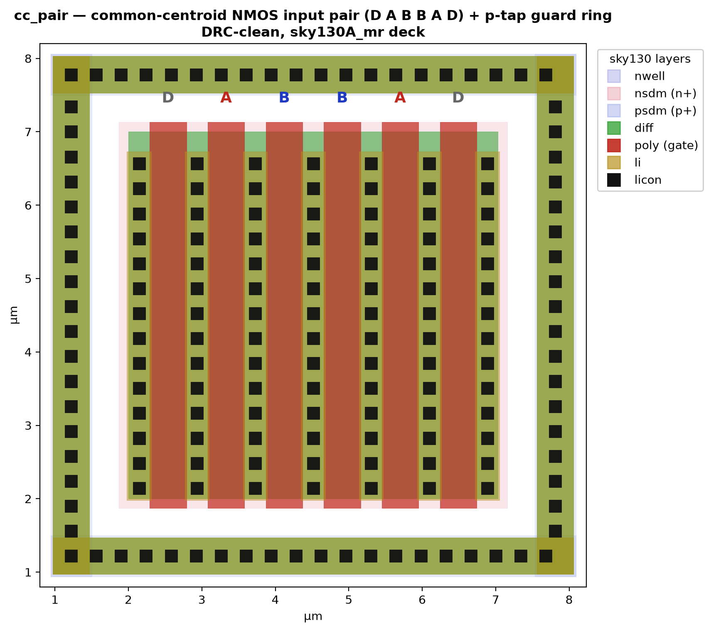
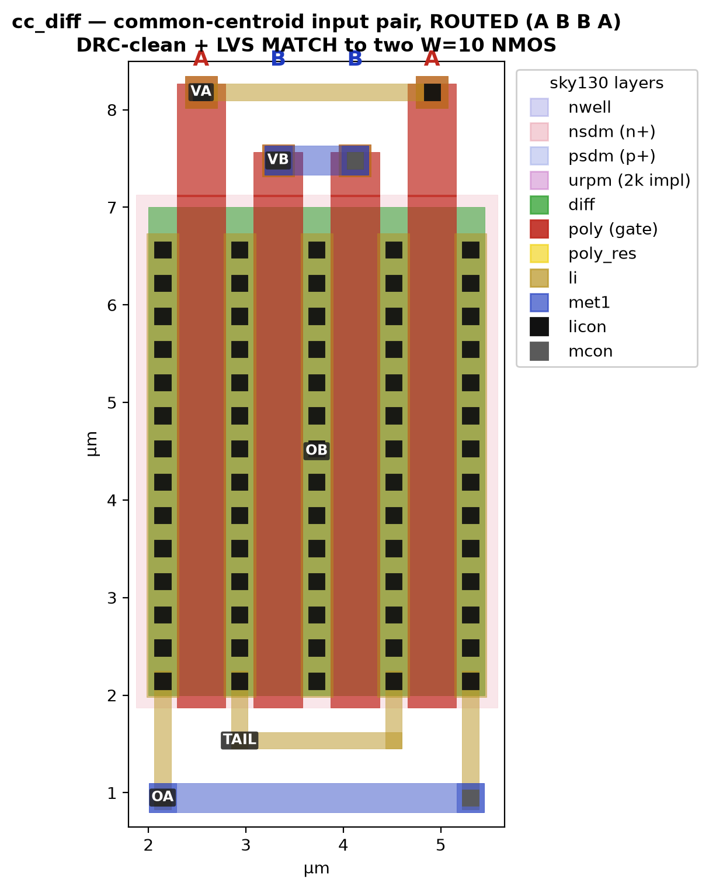
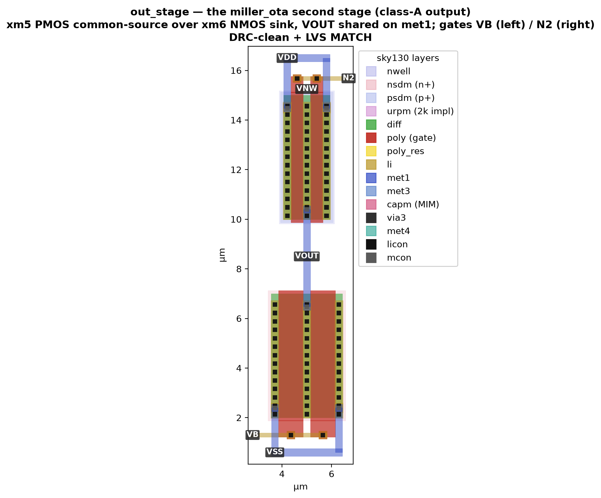
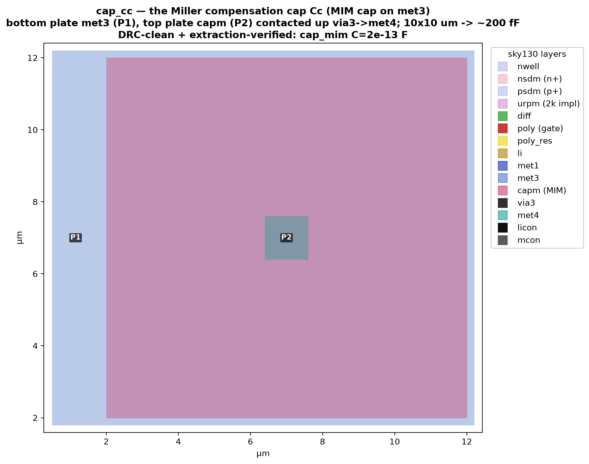
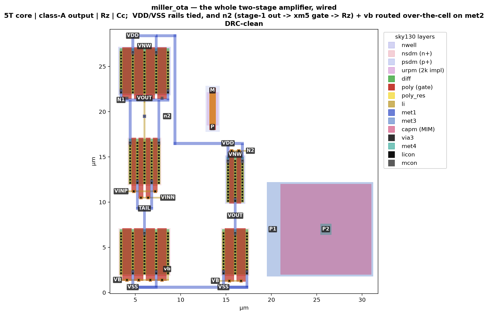

# Phase 2 — layout (kickoff)

Phase 1 characterised the amplifier at the schematic level; phase 2 draws it,
and post-layout is where analog designs go to die (matching, parasitics, wells,
substrate). This is the kickoff: the flow is stood up and the two hardest-to-
get-right pieces — a real multi-finger device and a **common-centroid** matched
pair — are drawn and **DRC-clean** against the sky130 deck.



## The flow

All gdstk (Python) → GDS → KLayout DRC, no GUI:

| file | does |
|---|---|
| `layout/device.py` | sky130 primitives: `fet(W, L, nf, kind)`, `guard_ring`, `poly_contact` (gate terminal), `label`, `strap` |
| `layout/build.py` | draws the cells to `layout/out/*.gds` |
| `layout/run_drc.py` | KLayout batch DRC (`sky130A_mr.drc`, feol+beol+offgrid), parses the `.lyrdb` |
| `layout/run_lvs.py` | KLayout LVS (`sky130.lvs`, patched for device-class case) vs a reference netlist |
| `layout/verify.py` | one-command regression: build → DRC all → LVS all (the `tb/run.py` of the layout side) |
| `layout/plot.py` | renders a cell to a layer-coloured PNG for these docs |

```sh
python layout/verify.py         # build + DRC-all + LVS-all -> "REGRESSION CLEAN"
python layout/plot.py           # -> docs/img/
```

The KLayout binary and the deck are the same ones the `stdcells` leg uses
(`~/AppData/Roaming/KLayout/klayout_app.exe`, the PDK's `sky130A_mr.drc`).

## The device primitive

`fet()` builds a multi-finger transistor: one diffusion strip crossed by `nf`
poly gates, every source/drain column stitched with a licon stack up to `li`,
the active wrapped in its implant (nsdm / psdm), and — for PMOS — an nwell. The
**layer map and every spacing are mirrored from the `stdcells` cells** (which
are DRC/LVS-clean on this PDK), so the device is clean *by construction*: the
`nfet_test` cell (W = 5, L = 0.5, 2 fingers) passed the deck on the first run.

## The common-centroid pair — the reason phase 2 exists

The input pair's offset (Monte-Carlo σ = 4.24 mV, `corners.md` §8) is a matching
problem, and matching is a *layout* property. `cc_pair` draws the two devices A
and B as six interleaved fingers **D A B B A D**: A sits at fingers 2 and 5, B at
3 and 4, so their centroids coincide at finger 3.5. A linear process/oxide/stress
gradient across the pair then adds equally to both and cancels to first order —
which a side-by-side layout cannot do. Dummy fingers (D) at the ends give the
outer real fingers the same poly-density neighbourhood as the inner ones, and a
**p-tap guard ring** collects substrate current and fixes the local body
potential. The whole structure is DRC-clean.

## LVS — proving it is the *right* circuit

DRC only checks geometry; a layout can be DRC-clean and still be the wrong
netlist (the `stdcells` leg found a NAND2 power-to-output short that DRC merged
silently — only LVS caught it). `run_lvs.py` extracts a cell with the PDK's
`sky130.lvs` deck (patched so the SPICE reader's uppercase device-class names
equate to the lowercase extracted ones) and compares it to a reference netlist.

`nfet_lvs` is the first device wired for it: a single finger with a **gate
contact** (poly → npc → licon → li) and **S / G / D labels**, bulk as a port
(the extractor exports the untapped p-substrate as one net). It extracts to
exactly `M0 D G S B nfet_01v8 L=0.5u W=5u` — **LVS MATCH**.

## The input pair, routed and LVS-clean

`cc_diff` takes the common-centroid arrangement and *connects* it into the
differential pair the OTA actually uses — and it is the piece where the routing
earns its keep.



The four fingers A B B A share one diffusion; alternating the source/drain
columns makes A = fingers 0,3 and B = fingers 1,2, each a **W = 10 µm** (2 × 5)
transistor with a **common source (tail)** — the input pair. Five nets have to
leave that strip without shorting, and there are only two routing layers, so
each net is placed where it can't collide: source/drain go **down**, gates go
**up**; the two nets that must span the middle — `TAIL` and `OA` — sit at
different heights (`TAIL` on li, `OA` on met1 one level below), so their risers
never cross; likewise `VA` runs on li and `VB` on met1, crossing only where
they are on different layers. It extracts to exactly two W=10 NMOS with a shared
source — **LVS MATCH**.

## The other matched pair — the PMOS mirror load

`pmos_mirror` is the input pair's counterpart (xm3/xm4), and it brings in
everything the NMOS work didn't touch: a **PMOS** device, its **nwell**, and an
**n-tap guard ring** to tie the well (proven first on the single `pfet_lvs`).
Same A B B A common-centroid, but a *mirror*: all four gates tie to `N1` and
xm3 is **diode-connected** (its gate = its drain = N1). That diode tie actually
makes the routing *tidier* than the differential pair — N1 (every gate plus the
A drains) all runs UP to one li strap, VDD (the sources) runs DOWN, VOUT stays
local — so nothing has to cross. It extracts to two W=10 PMOS, xm3 diode-tied —
**LVS MATCH**, DRC-clean on the first run.

## Status and what's next

| cell | DRC (`sky130A_mr`) | LVS (`sky130.lvs`) |
|---|---|---|
| `nfet_lvs` (1 finger, gate contact + S/G/D) | **CLEAN** | **MATCH** |
| `pfet_lvs` (PMOS in nwell + n-tap guard ring) | **CLEAN** | **MATCH** |
| `cc_pair` (D A B B A D + p-tap guard ring) | **CLEAN** | — (matching-structure demo) |
| `cc_diff` (A B B A routed NMOS input pair) | **CLEAN** | **MATCH** |
| `pmos_mirror` (A B B A routed PMOS mirror load) | **CLEAN** | **MATCH** |
| `tail_bias` (NMOS mirror: tail source + bias diode) | **CLEAN** | **MATCH** |
| `met2_test` (met1↔met2 via + met2-over-met1 crossing) | **CLEAN** | — (layer check) |
| `ota5t_core` (whole 5T OTA: 6 devices, 3 strips, routed) | **CLEAN** | **MATCH** |
| `out_stage` (miller stage 2: PMOS CS + NMOS sink, class-A) | **CLEAN** | **MATCH** |
| `res_rz` (xhigh_po poly resistor, ~10 kΩ) | **CLEAN** | **R=10 kΩ ✓** (extract) |
| `cap_cc` (MIM cap on met3, ~200 fF) | **CLEAN** | **C=200 fF ✓** (extract) |
| `miller_ota` (whole amp: 4 blocks + rails/n2/vb wired) | **CLEAN** | — (assembly) |

**All three sub-blocks of the 5T OTA — the NMOS input pair, the PMOS mirror
load, and the NMOS tail/bias — are laid out and verified as the right circuit,
and now so is the whole amplifier assembled from them.** Lessons banked:
mirroring the proven `stdcells` dimensions gets a device clean first try; a
li-connected tap ring beats stacking mcon on licon (74 `ct.2`); and once the net
*topology* is right (S/D and gates routed to layers/levels that can't collide)
LVS matches first try — every routed cell's only DRC fixes were sub-0.2 µm
connectivity near-misses, never topology.

## The 5T core, assembled and LVS-matched


`ota5t_core` places the three sub-blocks as **stacked common-centroid strips**
(mirror over input pair over tail) and routes the amplifier between them — the
piece the whole layout leg was building toward. It extracts to **exactly the six
transistors of `ota_5t.sp`** (bias diode, tail, input pair, mirror load) with
the internal nodes `n1` and `tail` and bulk ports `vnb`/`vnw` — **DRC-clean +
LVS MATCH**. The scaled W = 10 devices match the sub-block refs; the value here
is that the *assembly routing* is proven, not the devices (those were done).

The routing is where the congestion lives — the core has more distinct nets than
any sub-block. Three ideas keep every crossing on a different layer:

- **`n1` and `vout` never meet.** `n1` (the input A-drains and the whole mirror
  diode node) rides met1 up the **outer** columns; `vout` rides li up the
  **centre** column. Different x *and* different layer.
- **The input gates escape downward on li**, at two heights (vinp wide, vinn
  narrow), crossing the `tail` net — which is put on **met1** exactly where they
  cross — a layer below. This keeps the whole upper gap free for `n1`/`vout`.
- **Every source/drain leaves on met1 through a via that lands on a real licon
  stud *inside* the strip.** The device li stops ~0.27 µm short of the nominal
  strip edge, so a via at the edge floats — the first assembly attempt extracted
  with VDD, VOUT and the tail column disconnected for exactly this reason. The
  stacked source-contact (diff → licon → li → mcon → met1, on the stud) is the
  standard fix and is guaranteed to land on device li.

Lesson worth keeping: **a sub-block that is DRC+LVS-clean standalone does not
compose for free.** Each sub-block routed all its S/D one way (e.g. all down)
because it had a free side; stacked into the core, the same nets have to exit
*toward the neighbour they connect to*, so the input pair's routing had to be
redrawn (drains up, gates down) rather than instanced. The centroid *geometry*
carried over; the *routing* did not.

## The second stage — the class-A output



`out_stage` is the amplifier's **second stage** — `xm5`, a PMOS common-source
driven by the stage-1 output `n2`, over `xm6`, an NMOS current sink biased by
`vb`; their drains are tied as `VOUT`. It is the same shape as a CMOS inverter
(a p-device over an n-device sharing a drain), which is exactly what a class-A
output stage *is*. It extracts to the two transistors of `miller_ota.sp`'s stage
2 — **DRC-clean + LVS MATCH, first run** — because the two hard-won 5T-core
lessons carried straight over: sources leave on met1 through a via on a real
licon stud inside the strip, and the gates escape to the *sides* on li while the
drains meet on met1 up the centre, so nothing collides. Scaled W = 10 stands in
for the shipped W = 60 drive device; the topology and routing are what's proven.

## The first passive — the nulling resistor Rz


`res_rz` is the amplifier's **nulling resistor** — the `Rz` in series with the
compensation cap that the THD fix set to 10 kΩ. It is the leg's first *passive*
and its first PDK **special-marker** device: a poly strip whose middle 3.45 µm
is declared resistive by the `poly_res` (66/13) marker, wrapped in the `urpm`
(79/20) 2 kΩ/sq implant and `psdm`, with a contacted poly terminal at each end
*outside* the marker (which is what the extractor reads as a pin). At 0.69 µm
width and 3.45 µm length that is **5 squares × 2000 Ω/sq = 10 kΩ**, and the
extractor confirms it exactly.

## The compensation cap Cc — the MIM capacitor



`cap_cc` is the **compensation cap** `Cc` — a sky130 **MIM** (metal-insulator-
metal) capacitor, the linear cap a Miller amplifier wants. The bottom plate is
`met3` (`P1`); the top plate is `capm` (89/44) sitting on it with the MIM
dielectric between (`P2`), contacted *upward* through a `via3` to a `met4` pad.
The connectivity has a subtlety the deck handles cleanly: `connect(met3_ncap,
via3)` bonds a via to met3 only *outside* the top plate, while `connect(capm,
via3)` bonds the top-plate via to `capm` — so a `via3` dropped on `capm` reaches
`capm → met4` (P2) and never the `met3` bottom plate under it. The 10×10 µm plate
is a scaled demonstration at **~200 fF** (the full 4 pF `Cc` is ~20× this area);
the extractor confirms `sky130_fd_pr__model__cap_mim` at **C = 2e-13 F**.

## On verifying the passives — a real deck asymmetry, named honestly

Neither passive is in the LVS *compare* set; both are checked by *extraction*
(`run_passive_extract.py`, wired into `verify.py`), and that is a deliberate,
documented choice, not a shortcut. The sky130 KLayout deck's SPICE **reader
delegate** only builds properly *named* device classes for the devices it handles
explicitly — MOS, the VPP capacitors, inductors. A precision **poly resistor** is
extracted as a **3-terminal** `resistor_with_bulk` but read back as a 2-terminal
`R` (there is a 3-terminal reader path for the VPP caps, but none for a bulk
resistor). A **MIM cap** is 2-terminal, but it falls through to a *generic* `C`
class (only VPP caps get the model name) and the delegate also force-appends a
default `C=2e-16` that overrides any value written. So neither can be paired by a
hand-written reference, however it is phrased — I confirmed this empirically
before concluding it. Extraction is the meaningful check for a passive anyway: it
confirms the drawn geometry **is** the intended PDK device *and* measures its
value (`res_xhigh_po_0p69` @ **R = 10000 Ω**; `cap_mim` @ **C = 2e-13 F**), which
is exactly what matters for devices whose value is the spec.

## The whole amplifier, assembled and wired



`miller_ota` places the four verified blocks as one cell — the **5T core**
(stage 1), the **class-A output** (stage 2), the **nulling resistor** `Rz` and the
**MIM cap** `Cc` — and **wires the amplifier**:

- the **VDD and VSS rails** are tied across the two active stages on met1, in the
  clean gap between them;
- **`n2`**, the inter-stage signal, carries the stage-1 output to the `xm5` gate
  *and* to `Rz.P` (the compensation tap);
- **`vb`**, the shared bias, ties the stage-1 tail diode to the stage-2 sink gate.

The signal nets were the interesting part. Each block's `n2`/`vb`/`N2`/`VB` pins
are thin (0.17 µm) `li` buried mid-cell — they were never brought to an abutment
edge — so rather than re-open the blocks, `n2` and `vb` are **routed *over* the
cells on met2**, which is free above these `li`/`met1` blocks: a via stack taps
each pin up (li → met1 → met2), the wire runs across on met2, and another stack
drops down at the far pin. The whole wired cell is **DRC-clean**. This is the
*"a block does not compose for free"* lesson from the 5T core, one level up — and
the over-the-cell metal layer is the answer to it at amplifier scale.

**What's still open on the wiring.** The active signal path (`n2`, `vb`) and the
rails are routed; the **`Rz`/`Cc` compensation branch** is not yet closed — that
needs the cap's plates (`Cc` is on met3/met4) tied to `Rz.M` (`nz`) and to `vout`
through a met2→met3→met4 via stack. And a **whole-amp post-extract** LVS remains
the signoff (the passives block a device *compare*, and KLayout's deep-mode
extractor errors on the large flattened multi-block cell — a tooling quirk, not a
geometry one; every sub-block is individually verified).

## What's next

- **Close the compensation branch** — tie `Rz.M` (`nz`) to the `Cc` bottom plate
  and the `Cc` top plate to `vout`, through a met2 → met3 → met4 via stack (the
  cap's plates live on the upper metals). The active path (`n2`, `vb`) and the
  rails are already wired.
- **Post-extraction re-simulation** — run the benches again on the parasitic-
  extracted netlist, the number that actually decides whether the silicon works.
- **Rail-tie guard rings** (substrate → VSS, nwell → VDD) replace the bulk
  *ports* with real body ties.
