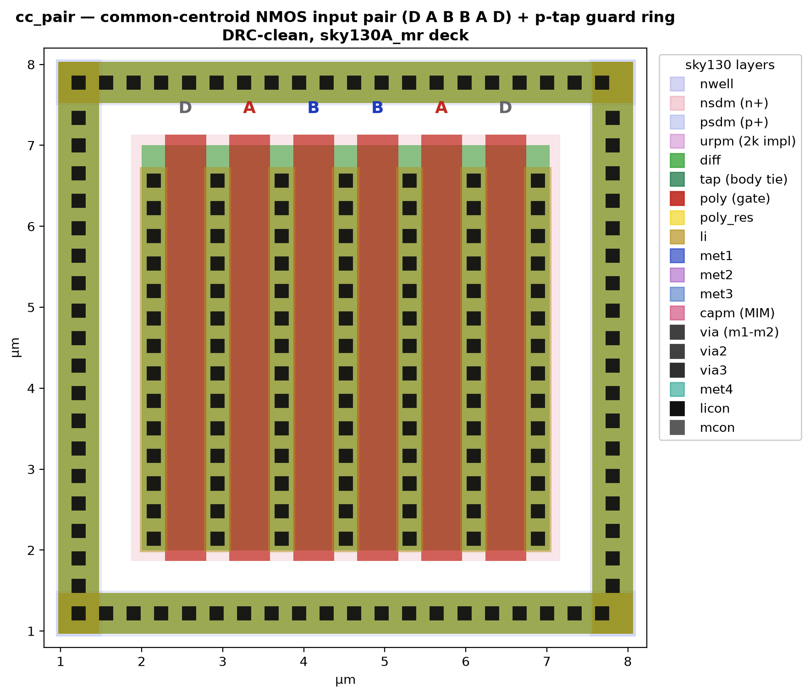
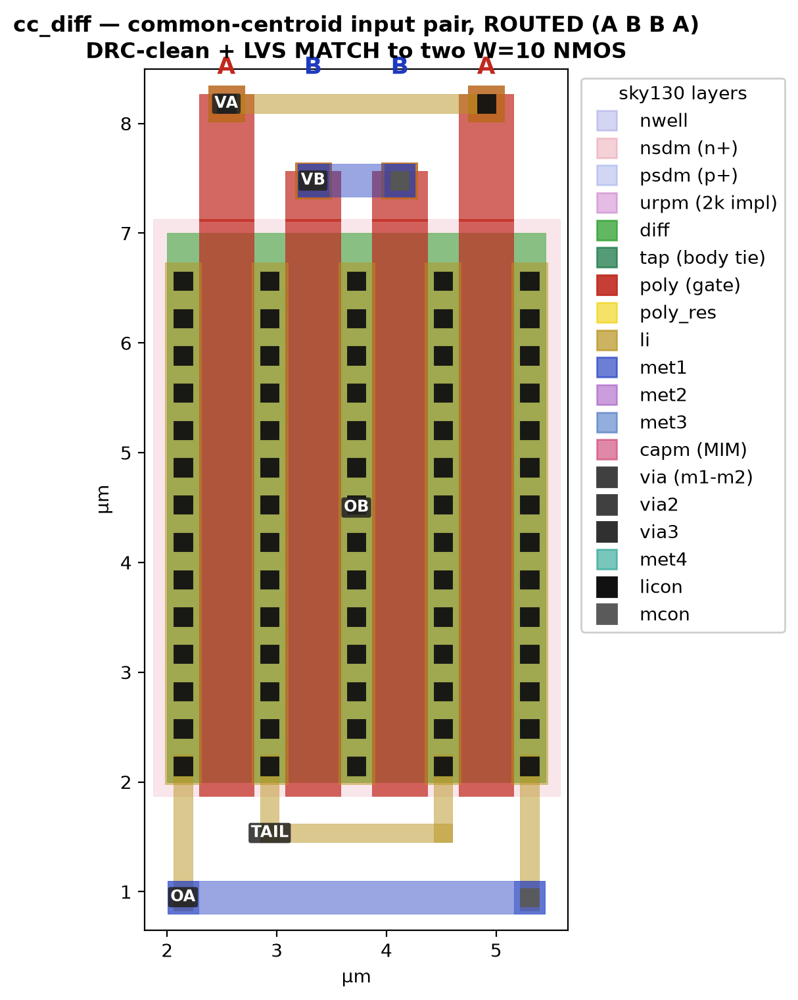
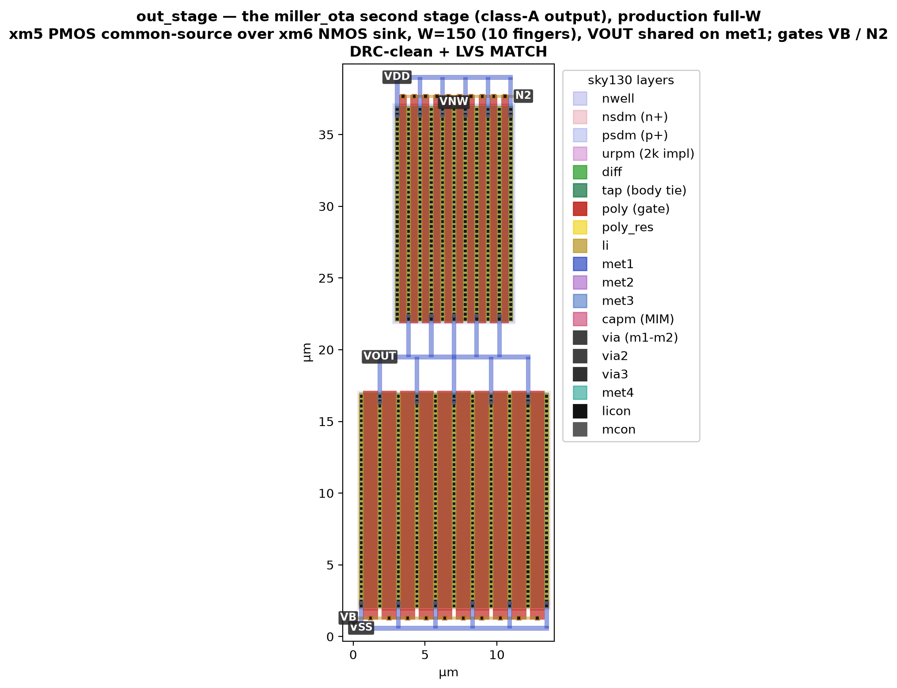
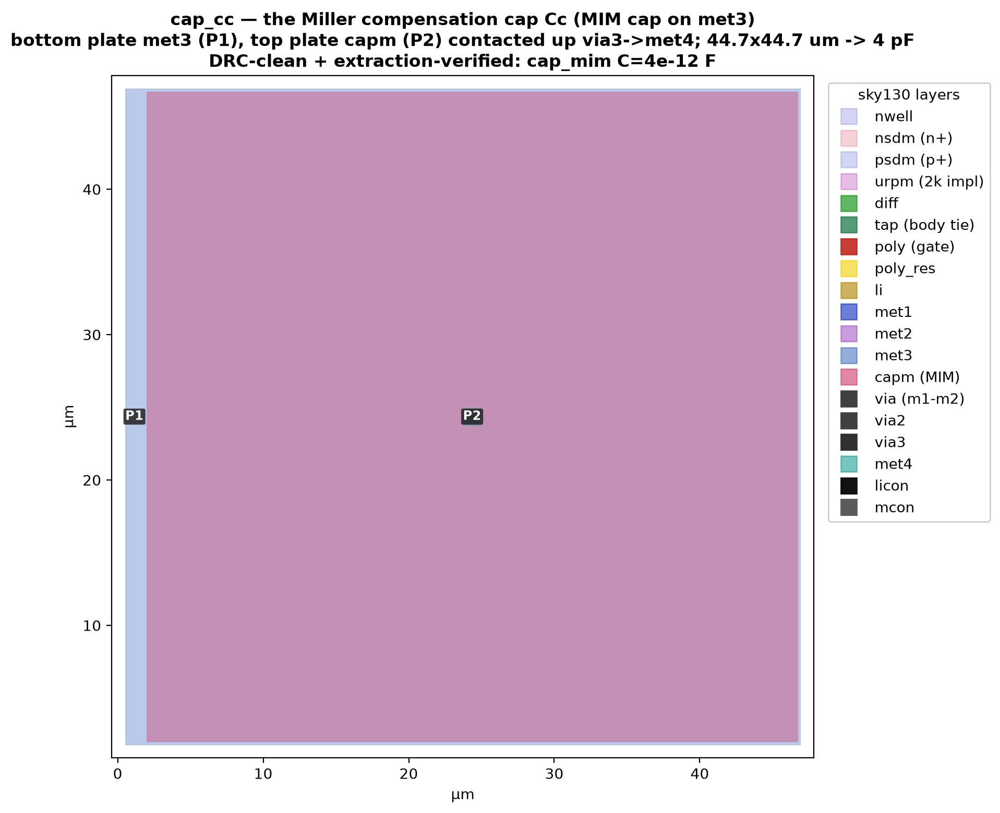
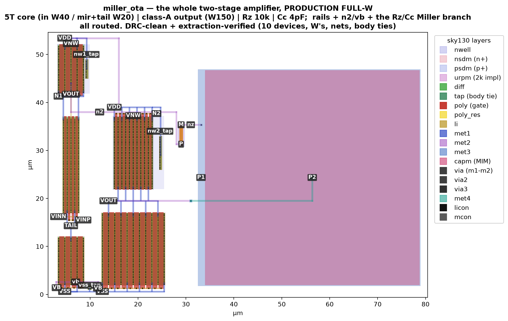
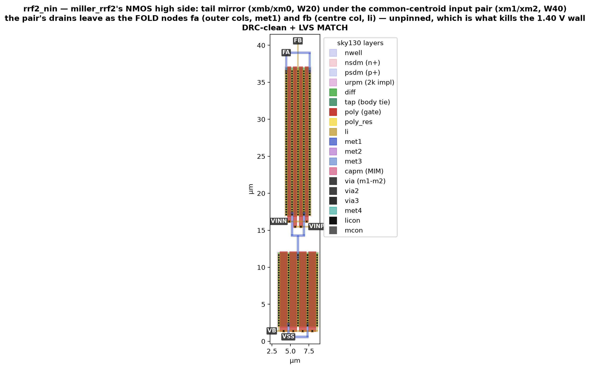
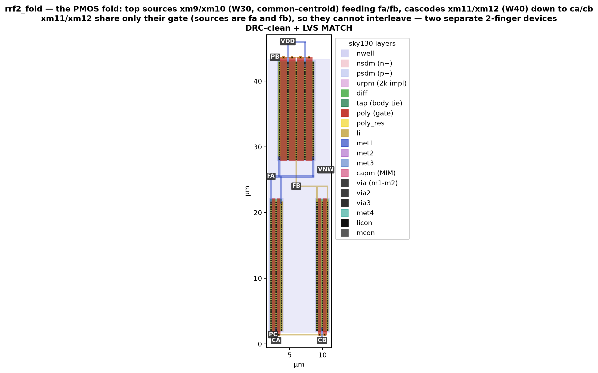
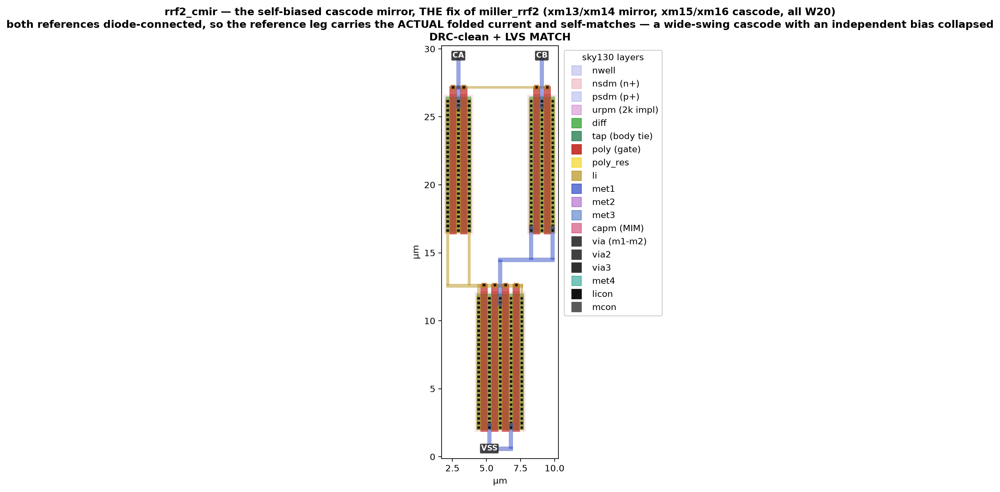
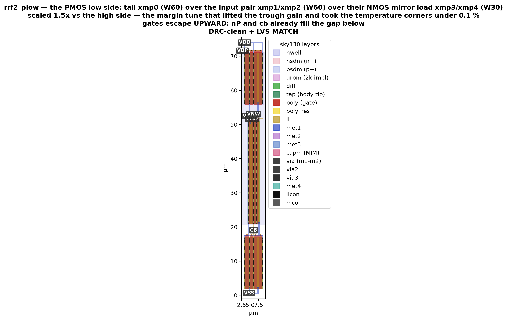

# Phase 2 — layout (kickoff)

Phase 1 characterised the amplifier at the schematic level; phase 2 draws it,
and post-layout is where analog designs go to die (matching, parasitics, wells,
substrate). This is the kickoff: the flow is stood up and the two hardest-to-
get-right pieces — a real multi-finger device and a **common-centroid** matched
pair — are drawn and **DRC-clean** against the sky130 deck.



## The flow

All gdstk (Python) → GDS → KLayout DRC, no GUI:

| file | does |
|---|---|
| `layout/device.py` | sky130 primitives: `fet(W, L, nf, kind)`, `guard_ring`, `poly_contact` (gate terminal), `label`, `strap` |
| `layout/build.py` | draws the cells to `layout/out/*.gds` |
| `layout/run_drc.py` | KLayout batch DRC (`sky130A_mr.drc`, feol+beol+offgrid), parses the `.lyrdb` |
| `layout/run_lvs.py` | KLayout LVS (`sky130.lvs`, patched for device-class case) vs a reference netlist |
| `layout/verify.py` | one-command regression: build → DRC all → LVS all (the `tb/run.py` of the layout side) |
| `layout/plot.py` | renders a cell to a layer-coloured PNG for these docs |

```sh
python layout/verify.py         # build + DRC-all + LVS-all -> "REGRESSION CLEAN"
python layout/plot.py           # -> docs/img/
```

The KLayout binary and the deck are the same ones the `stdcells` leg uses
(`~/AppData/Roaming/KLayout/klayout_app.exe`, the PDK's `sky130A_mr.drc`).

## The device primitive

`fet()` builds a multi-finger transistor: one diffusion strip crossed by `nf`
poly gates, every source/drain column stitched with a licon stack up to `li`,
the active wrapped in its implant (nsdm / psdm), and — for PMOS — an nwell. The
**layer map and every spacing are mirrored from the `stdcells` cells** (which
are DRC/LVS-clean on this PDK), so the device is clean *by construction*: the
`nfet_test` cell (W = 5, L = 0.5, 2 fingers) passed the deck on the first run.

## The common-centroid pair — the reason phase 2 exists

The input pair's offset (Monte-Carlo σ = 4.24 mV, `corners.md` §8) is a matching
problem, and matching is a *layout* property. `cc_pair` draws the two devices A
and B as six interleaved fingers **D A B B A D**: A sits at fingers 2 and 5, B at
3 and 4, so their centroids coincide at finger 3.5. A linear process/oxide/stress
gradient across the pair then adds equally to both and cancels to first order —
which a side-by-side layout cannot do. Dummy fingers (D) at the ends give the
outer real fingers the same poly-density neighbourhood as the inner ones, and a
**p-tap guard ring** collects substrate current and fixes the local body
potential. The whole structure is DRC-clean.

## LVS — proving it is the *right* circuit

DRC only checks geometry; a layout can be DRC-clean and still be the wrong
netlist (the `stdcells` leg found a NAND2 power-to-output short that DRC merged
silently — only LVS caught it). `run_lvs.py` extracts a cell with the PDK's
`sky130.lvs` deck (patched so the SPICE reader's uppercase device-class names
equate to the lowercase extracted ones) and compares it to a reference netlist.

`nfet_lvs` is the first device wired for it: a single finger with a **gate
contact** (poly → npc → licon → li) and **S / G / D labels**, bulk as a port
(the extractor exports the untapped p-substrate as one net). It extracts to
exactly `M0 D G S B nfet_01v8 L=0.5u W=5u` — **LVS MATCH**.

## The input pair, routed and LVS-clean

`cc_diff` takes the common-centroid arrangement and *connects* it into the
differential pair the OTA actually uses — and it is the piece where the routing
earns its keep.



The four fingers A B B A share one diffusion; alternating the source/drain
columns makes A = fingers 0,3 and B = fingers 1,2, each a **W = 10 µm** (2 × 5)
transistor with a **common source (tail)** — the input pair. Five nets have to
leave that strip without shorting, and there are only two routing layers, so
each net is placed where it can't collide: source/drain go **down**, gates go
**up**; the two nets that must span the middle — `TAIL` and `OA` — sit at
different heights (`TAIL` on li, `OA` on met1 one level below), so their risers
never cross; likewise `VA` runs on li and `VB` on met1, crossing only where
they are on different layers. It extracts to exactly two W=10 NMOS with a shared
source — **LVS MATCH**.

## The other matched pair — the PMOS mirror load

`pmos_mirror` is the input pair's counterpart (xm3/xm4), and it brings in
everything the NMOS work didn't touch: a **PMOS** device, its **nwell**, and an
**n-tap guard ring** to tie the well (proven first on the single `pfet_lvs`).
Same A B B A common-centroid, but a *mirror*: all four gates tie to `N1` and
xm3 is **diode-connected** (its gate = its drain = N1). That diode tie actually
makes the routing *tidier* than the differential pair — N1 (every gate plus the
A drains) all runs UP to one li strap, VDD (the sources) runs DOWN, VOUT stays
local — so nothing has to cross. It extracts to two W=10 PMOS, xm3 diode-tied —
**LVS MATCH**, DRC-clean on the first run.

## Status and what's next

| cell | DRC (`sky130A_mr`) | LVS (`sky130.lvs`) |
|---|---|---|
| `nfet_lvs` (1 finger, gate contact + S/G/D) | **CLEAN** | **MATCH** |
| `pfet_lvs` (PMOS in nwell + n-tap guard ring) | **CLEAN** | **MATCH** |
| `cc_pair` (D A B B A D + p-tap guard ring) | **CLEAN** | — (matching-structure demo) |
| `cc_diff` (A B B A routed NMOS input pair) | **CLEAN** | **MATCH** |
| `pmos_mirror` (A B B A routed PMOS mirror load) | **CLEAN** | **MATCH** |
| `tail_bias` (NMOS mirror: tail source + bias diode) | **CLEAN** | **MATCH** |
| `met2_test` (met1↔met2 via + met2-over-met1 crossing) | **CLEAN** | — (layer check) |
| `ota5t_core` (whole 5T OTA: 6 devices, 3 strips, routed) | **CLEAN** | **MATCH** |
| `out_stage` (miller stage 2: PMOS CS + NMOS sink, class-A) | **CLEAN** | **MATCH** |
| `res_rz` (xhigh_po poly resistor, ~10 kΩ) | **CLEAN** | **R=10 kΩ ✓** (extract) |
| `cap_cc` (MIM cap on met3, ~200 fF) | **CLEAN** | **C=200 fF ✓** (extract) |
| `miller_ota` (whole amp: 4 blocks, **fully wired**) | **CLEAN** | **10 dev + nets ✓** (extract) |

**All three sub-blocks of the 5T OTA — the NMOS input pair, the PMOS mirror
load, and the NMOS tail/bias — are laid out and verified as the right circuit,
and now so is the whole amplifier assembled from them.** Lessons banked:
mirroring the proven `stdcells` dimensions gets a device clean first try; a
li-connected tap ring beats stacking mcon on licon (74 `ct.2`); and once the net
*topology* is right (S/D and gates routed to layers/levels that can't collide)
LVS matches first try — every routed cell's only DRC fixes were sub-0.2 µm
connectivity near-misses, never topology.

## The 5T core, assembled and LVS-matched


`ota5t_core` places the three sub-blocks as **stacked common-centroid strips**
(mirror over input pair over tail) and routes the amplifier between them — the
piece the whole layout leg was building toward. It extracts to **exactly the six
transistors of `ota_5t.sp`** (bias diode, tail, input pair, mirror load) with
the internal nodes `n1` and `tail` and bulk ports `vnb`/`vnw` — **DRC-clean +
LVS MATCH**. The scaled W = 10 devices match the sub-block refs; the value here
is that the *assembly routing* is proven, not the devices (those were done).

The routing is where the congestion lives — the core has more distinct nets than
any sub-block. Three ideas keep every crossing on a different layer:

- **`n1` and `vout` never meet.** `n1` (the input A-drains and the whole mirror
  diode node) rides met1 up the **outer** columns; `vout` rides li up the
  **centre** column. Different x *and* different layer.
- **The input gates escape downward on li**, at two heights (vinp wide, vinn
  narrow), crossing the `tail` net — which is put on **met1** exactly where they
  cross — a layer below. This keeps the whole upper gap free for `n1`/`vout`.
- **Every source/drain leaves on met1 through a via that lands on a real licon
  stud *inside* the strip.** The device li stops ~0.27 µm short of the nominal
  strip edge, so a via at the edge floats — the first assembly attempt extracted
  with VDD, VOUT and the tail column disconnected for exactly this reason. The
  stacked source-contact (diff → licon → li → mcon → met1, on the stud) is the
  standard fix and is guaranteed to land on device li.

Lesson worth keeping: **a sub-block that is DRC+LVS-clean standalone does not
compose for free.** Each sub-block routed all its S/D one way (e.g. all down)
because it had a free side; stacked into the core, the same nets have to exit
*toward the neighbour they connect to*, so the input pair's routing had to be
redrawn (drains up, gates down) rather than instanced. The centroid *geometry*
carried over; the *routing* did not.

## The second stage — the class-A output



`out_stage` is the amplifier's **second stage** — `xm5`, a PMOS common-source
driven by the stage-1 output `n2`, over `xm6`, an NMOS current sink biased by
`vb`; their drains are tied as `VOUT`. It is the same shape as a CMOS inverter
(a p-device over an n-device sharing a drain), which is exactly what a class-A
output stage *is*. It extracts to the two transistors of `miller_ota.sp`'s stage
2 — **DRC-clean + LVS MATCH, first run** — because the two hard-won 5T-core
lessons carried straight over: sources leave on met1 through a via on a real
licon stud inside the strip, and the gates escape to the *sides* on li while the
drains meet on met1 up the centre, so nothing collides. Scaled W = 10 stands in
for the shipped W = 60 drive device; the topology and routing are what's proven.

## The first passive — the nulling resistor Rz


`res_rz` is the amplifier's **nulling resistor** — the `Rz` in series with the
compensation cap that the THD fix set to 10 kΩ. It is the leg's first *passive*
and its first PDK **special-marker** device: a poly strip whose middle 3.45 µm
is declared resistive by the `poly_res` (66/13) marker, wrapped in the `urpm`
(79/20) 2 kΩ/sq implant and `psdm`, with a contacted poly terminal at each end
*outside* the marker (which is what the extractor reads as a pin). At 0.69 µm
width and 3.45 µm length that is **5 squares × 2000 Ω/sq = 10 kΩ**, and the
extractor confirms it exactly.

## The compensation cap Cc — the MIM capacitor



`cap_cc` is the **compensation cap** `Cc` — a sky130 **MIM** (metal-insulator-
metal) capacitor, the linear cap a Miller amplifier wants. The bottom plate is
`met3` (`P1`); the top plate is `capm` (89/44) sitting on it with the MIM
dielectric between (`P2`), contacted *upward* through a `via3` to a `met4` pad.
The connectivity has a subtlety the deck handles cleanly: `connect(met3_ncap,
via3)` bonds a via to met3 only *outside* the top plate, while `connect(capm,
via3)` bonds the top-plate via to `capm` — so a `via3` dropped on `capm` reaches
`capm → met4` (P2) and never the `met3` bottom plate under it. The 10×10 µm plate
is a scaled demonstration at **~200 fF** (the full 4 pF `Cc` is ~20× this area);
the extractor confirms `sky130_fd_pr__model__cap_mim` at **C = 2e-13 F**.

## On verifying the passives — a real deck asymmetry, named honestly

Neither passive is in the LVS *compare* set; both are checked by *extraction*
(`run_passive_extract.py`, wired into `verify.py`), and that is a deliberate,
documented choice, not a shortcut. The sky130 KLayout deck's SPICE **reader
delegate** only builds properly *named* device classes for the devices it handles
explicitly — MOS, the VPP capacitors, inductors. A precision **poly resistor** is
extracted as a **3-terminal** `resistor_with_bulk` but read back as a 2-terminal
`R` (there is a 3-terminal reader path for the VPP caps, but none for a bulk
resistor). A **MIM cap** is 2-terminal, but it falls through to a *generic* `C`
class (only VPP caps get the model name) and the delegate also force-appends a
default `C=2e-16` that overrides any value written. So neither can be paired by a
hand-written reference, however it is phrased — I confirmed this empirically
before concluding it. Extraction is the meaningful check for a passive anyway: it
confirms the drawn geometry **is** the intended PDK device *and* measures its
value (`res_xhigh_po_0p69` @ **R = 10000 Ω**; `cap_mim` @ **C = 2e-13 F**), which
is exactly what matters for devices whose value is the spec.

## The whole amplifier, assembled and wired



`miller_ota` places the four verified blocks as one cell — the **5T core**
(stage 1), the **class-A output** (stage 2), the **nulling resistor** `Rz` and the
**MIM cap** `Cc` — and **wires the amplifier**:

- the **VDD and VSS rails** are tied across the two active stages on met1, in the
  clean gap between them;
- **`n2`**, the inter-stage signal, carries the stage-1 output to the `xm5` gate
  *and* to `Rz.P` (the compensation tap);
- **`vb`**, the shared bias, ties the stage-1 tail diode to the stage-2 sink gate;
- the whole **`Rz`/`Cc` Miller compensation branch** — `n2`–`Rz`–`nz`–`Cc`–`vout`.

The signal nets were the interesting part. Each block's `n2`/`vb`/`N2`/`VB` pins
are thin (0.17 µm) `li` buried mid-cell — they were never brought to an abutment
edge — so rather than re-open the blocks, the signals are **routed *over* the
cells on the upper metals**, which are free above these `li`/`met1` blocks: a via
stack taps each pin up (li → met1 → met2), the wire runs across on met2, and
another stack drops down at the far pin. The compensation branch needed the two
layers *above* that: `nz` taps `Rz.M` up to met2 and drops onto the `Cc` bottom
plate through a **met2→met3 (via2)**, and `vout` climbs an **isolated
met2→met3→met4 stack** (placed left of the plate so it never lands on the met3
bottom plate) and crosses on met4 to the `Cc` top plate. The whole wired cell is
**DRC-clean**. This is the *"a block does not compose for free"* lesson from the
5T core, one level up — and the over-the-cell metal stack is the answer to it at
amplifier scale.

**The wiring is verified — by extraction.** The whole assembled amplifier
extracts to **exactly the ten devices of `miller_ota.sp`** — 5 NMOS + 3 PMOS +
the poly resistor + the MIM cap — and, crucially, the *connectivity* is right:
KLayout tags each extracted net with every label on it, so the nets come out
named `N2|P|VOUT|n2` (stage-1 output = `xm5` gate = `Rz.P`), `P2|VOUT` (output =
`Cc` top plate), `M|P1|nz` (`Rz.M` = `Cc` bottom plate) and `VB|vb` — proof that
the routing joined the nodes it was supposed to. `run_amp_extract.py` asserts the
device count and those four merges, wired into `verify.py`. (This is the whole-amp
LVS in the form the passives allow: they block a hand-written device *compare*,
but the extraction itself confirms the circuit. The earlier "extractor error" on
the flattened cell was a stale relative *path*, not a real failure.)

One honest note on **polarity**: the layout reuses `ota5t_core` (drawn as
`ota_5t`, `xm1` gate = `vinp`), so the extracted amp has `vinp`/`vinn` on the
opposite sides from `miller_ota.sp`'s inverting convention. The topology is
identical; which input is the inverting one is a label choice (swap the two
`VIN` labels to match the schematic's feedback sign).

## Body ties — the amplifier is fully tied

Left untied, the amplifier's bodies float: the extractor puts all five NMOS bulks
on a nameless `sky130_gnd` net and each nwell on its own floating net, none of
them on a rail. Real analog silicon can't ship that way (latch-up, substrate and
well noise). So the assembly ties them all:

- **Substrate → VSS**: a single **p+ tap** in the open gap, wired to the `VSS`
  rail. The substrate is one global net, so one contact ties the whole NMOS bulk.
- **Each nwell → VDD**: an **n+ tap** in each of the two wells (the stage-1 mirror
  and the stage-2 PMOS), wired to `VDD`. The wells are *widened* at the top level
  into the open area to make room for the taps.

The re-extraction confirms all of it — **all 5 NMOS report bulk = `VSS`, all 3
PMOS report bulk = `VDD`** — and `run_amp_extract.py` asserts both. The amplifier
is now fully body-tied.

The catch worth recording: a body tie must be drawn on the **`tap` layer (65/44)**,
not plain active diff (65/20). The deck bonds the substrate through `ptap_conn =
tap.and(psdm).not(nwell)` → `connect(sub, ptap_conn)`, and a well through
`ntap_conn = tap.and(nsdm).and(nwell)` → `connect(nwell, ntap_conn)`. A diff-drawn
tap is DRC-clean but electrically inert — exactly what the first attempt showed
(the tap's li merged to `VSS`, yet the substrate stayed floating on `sky130_gnd`).

## Production full-W redraw + parasitic RC re-sim (the tapeout-prep pass)

The blocks were redrawn at the taped-out sizing — the corner-verified THD fix
(`design-notes.md` §12): input pair `W = 40` (m8), mirror + tail/bias `W = 20`
(m4), class-A output `W = 150` (m30), `Cc = 4 pF`, `Rz = 10 kΩ`. The method that
kept the redraw a low-risk *y-remap* rather than a rewrite: for the **matched**
pairs (input, mirror, tail) the full width was reached by **finger width**, not
finger count — the proven nf = 4 `A B B A` common-centroid interleave is kept, so
every x-coordinate and the LVS topology are unchanged and only the strip heights
move. The **output** devices are unmatched, so they became plain 10-finger
multi-finger FETs; `Cc` became a 44.7 µm MIM plate. The whole-amp extraction now
reports **exactly those widths** on all ten devices (`nfet W=40 ×2`, `W=20 ×3`,
`W=150`; `pfet W=20 ×2`, `W=150`; `res R=10 kΩ`; `cap C=4 pF`).

The **feedback sign** went in at the same pass: the input labels now match
`miller_ota.sp`'s inverting convention (`VINN`→`n1`, the diode/mirror side;
`VINP`→`n2`, the stage-1 output), and `run_amp_extract.py` **asserts** it — a
latched output from a wrong sign is a silent failure, so it earns a regression
check.

With full W the layout's real interconnect finally matters, so it was extracted
and re-simulated ([`parasitics.md`](parasitics.md)): the routing adds only
**~14 fF total** — a ~22 µm met2 trunk on the Miller node `n2` (3.9 fF) and a
~30 µm met4 run carrying `vout` across the 45 µm cap (6.2 fF) dominate — against
the **4 pF** Miller cap, so the phase margin moves **−0.13°** (81.0° → 80.9°,
spec 60°) and THD is unchanged. The amplifier meets spec with its real routing in
place. `layout/verify.py` stayed green throughout.

Still on the shelf (not gaps in *this* amp): a wider-ICMR input (rail-to-rail /
complementary pair) for THD < 0.1 % at full 1 Vpp, and real poly-R Monte-Carlo
signoff.

# miller_rrf2 — the spec-meeting amplifier, laid out from scratch

Everything above draws `miller_ota`. But `miller_ota` is **not** the amplifier
that met the distortion target: [`input-stage.md`](input-stage.md) traced its
0.167 % residual at 1 Vpp to the input common-mode range and closed it with
**`miller_rrf2`** — a folded rail-to-rail input summed at a **self-biased
cascoded** node — which is robustly **under 0.1 % THD at 1 kHz across the full
PVT box** (0.046–0.092 %). That left the leg with a design and a layout that were
out of sync: the winning circuit had no geometry, and the drawn geometry was the
superseded circuit.

This closes it. `miller_rrf2` is now drawn, in `layout/build_rrf2.py` — `build.py`
is untouched, so `miller_ota` stays exactly as its tapeout-prep pass left it and
the two amplifiers now sit side by side in the same regression.


## What the topology costs in geometry

| | miller_ota | **miller_rrf2** |
|---|---|---|
| transistors | 8 (+ Rz + Cc) | **25** (+ Rz + Cc) |
| device blocks | 2 + 2 passives | **5 new + 2 reused + 2 passives** |
| top-level nets routed | 4 | **14** |
| Cc | 4 pF | **9 pF** |
| drawn area | 76 × 53 µm = 4 044 µm² | **177 × 96 µm = 17 070 µm²** |

**Stage 2 and the nulling resistor are reused verbatim.** `miller_rrf2` runs the
same `pout = 2.5` output stage and the same 10 kΩ `Rz` as the applied THD fix, so
`out_stage` (W = 150 / W = 150) and `res_rz` are instanced unchanged — a real
dividend from having verified them as standalone blocks. Only the cap changes:
the margin-tuning pass raised `Cc` to 9 pF to hold PM ≥ 73° once the PMOS
low-side path was scaled 1.5×, so `cap_cc9` is a 67.08 µm MIM plate
(extraction-verified at **C = 8.999 pF**).

## The five new blocks

| block | devices | idiom |
|---|---|---|
| `rrf2_nin` | xmb, xm0 (W20) + xm1, xm2 (W40) | tail mirror + common-centroid pair |
| `rrf2_fold` | xm9, xm10 (W30) + xm11, xm12 (W40) | common-gate dual leg + 2 separate cascodes |
| `rrf2_cmir` | xm13–xm16 (W20) | common-centroid mirror + stacked cascodes |
| `rrf2_plow` | xmp0 (W60), xmp1, xmp2 (W60), xmp3, xmp4 (W30) | tail + pair + mirror load |
| `rrf2_bias_n` / `rrf2_bias_p` | xbn1–3 / xbp1–3 | the bias chain, split at pb/pc/vbp |

Each is **DRC-clean and LVS-matched against a reference netlist** taken straight
off `spice/miller_rrf2.sp`, before anything was assembled.



### Common-centroid has a hard precondition, and four of these devices fail it

The A-B-B-A interleave that every matched pair in `miller_ota` uses needs the two
devices to **share a terminal**: in a 4-finger strip the columns between adjacent
A and B fingers are physically one diffusion, so they *must* be one net. That is
fine for a differential pair (shared source) or a mirror (shared source and gate)
— and it is impossible for `xm11`/`xm12`, whose sources are the two *different*
fold nodes `fa` and `fb`, and for `xm15`/`xm16`, whose sources are `yref` and
`cbm`. Those four are drawn as **separate 2-finger devices**, which is also the
natural floorplan: each cascode sits directly over the leg it cascodes.



### The interleave then dictates the routing layers

The same interleave has a second consequence that drove nearly every routing
decision in the leg. Device A's private terminal always lands on the **outer**
columns and B's on the **centre** one — so A's net has to be *bridged across the
middle*, exactly where B's riser is. The resolution is the invariant the whole
file is built on: **the outer net routes on met1, the centre net on li**, and the
bridge crosses the riser on a different layer. It is not a preference; with only
li and met1 inside a block there is no other way to get both out on the same side.



That is also why **`rrf2_plow`'s input gates escape upward**, which looks
gratuitous next to `miller_ota`, where they escape down. The gap below the PMOS
pair already carries `nP` (outer, met1) and `cb` (centre, li) — both layers
spoken for — and a `VINN` strap has no choice but to span the middle to reach
gates g0 and g3. Routed downward it would short one of them. And it is why the
**bias chain is two cells, not one**: `pb`, `pc`, `vbp` and `vb` are four nets
that must cross between the PMOS and NMOS halves, in a channel that holds two.
Splitting at those nets costs nothing, because all three are top-level nets
anyway — they feed the fold and the low-side path.



## The top level: a two-layer channel

`miller_ota` had four nets to route and did it ad hoc. Fourteen nets needs a
discipline, so the assembly uses a proper **channel**: one horizontal **met3**
track per net above the whole row, one vertical **met2** riser per pin. One layer
per direction means a riser and a track can never share a layer, so the channel
is **short-free by construction** — and because `li`/`met1` stay inside the
blocks, met2 crosses any block freely and met3 crosses any riser freely.

The blocks are placed in signal order with **disjoint x-windows**, which is the
other half of the guarantee: every riser lives inside its own block's window, so
risers from different blocks cannot collide, and only the within-block spacing
needs checking. `build_rrf2.py` asserts exactly that (`_check_risers()`) before
drawing anything — risers ≥ 0.5 µm apart within a block, met3 landing pads
≥ 0.7 µm apart on a shared track — so a bad tap coordinate fails in Python
immediately instead of in a DRC report several minutes later.

The compensation branch is the exception that still needs hand-routing, and it
reuses `miller_ota`'s solution: `nz` taps `Rz.M` up to met2 and drops onto the
`Cc` bottom plate through a via2; `vout` climbs met2 → met3 → met4 and crosses on
met4 to the top plate. One difference — `vout`'s long run to the cap is on
**met3**, not met2, because `out_stage`'s VSS and VDD risers already own met2 at
those x for the full height of the cell.

## Verification — 27 devices, 14 nets, every connection named

The blocks are LVS-compared; the top level is extraction-checked, for the same
deck reason as `miller_ota` (the poly resistor and the MIM cap cannot be paired
by a hand-written reference — see the section above). But the extraction check
here is deliberately **stronger** than `miller_ota`'s, and it had to be.

`miller_ota` could assert net merges by *name*: its merged nets happened to carry
distinct labels, so a net called `N2|P|n2` was itself proof that three nodes had
joined. That does not work here — **five different blocks all call the summing
node `CB`**, so an extracted net named `CB` could equally be one block's pin,
connected to nothing. So the assembly drops a **unique tag on every riser**
(`cb_fold`, `cb_cmir`, `cb_plow`, `cb_out`, …) and `run_rrf2_extract.py` asserts
that all of a net's tags land on **one** extracted net. Every single
block-to-block connection in the amplifier is therefore individually checked —
**14 nets, 39 tagged pins** — plus:

- the **device set**: 14 NMOS + 11 PMOS + 1 poly resistor + 1 MIM cap;
- **body ties**: all 14 NMOS bulks on `VSS`, all 11 PMOS bulks on `VDD` (one
  substrate p-tap; an n-tap in each of the **four** nwells);
- **polarity, end to end**: `VINN`→`fa` / `VINP`→`fb` on the NMOS pair *and*
  `VINP`→`cb` on the PMOS pair. Both pairs work in parallel — that is the whole
  point of a rail-to-rail input — so getting either one backwards is positive
  feedback and a latched output. Silent in DC, fatal in silicon, so it earns a
  regression check.

| cell | DRC (`sky130A_mr`) | LVS / extract |
|---|---|---|
| `rrf2_nin` (tail mirror + input pair, W20/W40) | **CLEAN** | **MATCH** |
| `rrf2_fold` (fold sources + cascodes, W30/W40) | **CLEAN** | **MATCH** |
| `rrf2_cmir` (self-biased cascode mirror, W20 ×4) | **CLEAN** | **MATCH** |
| `rrf2_plow` (PMOS tail + pair + mirror, W60/W60/W30) | **CLEAN** | **MATCH** |
| `rrf2_bias_n` (xbn1/xbn2/xbn3) | **CLEAN** | **MATCH** |
| `rrf2_bias_p` (xbp1/xbp2/xbp3) | **CLEAN** | **MATCH** |
| `cap_cc9` (MIM cap, 67.08 µm plate) | **CLEAN** | **C = 8.999 pF ✓** (extract) |
| `miller_rrf2` (whole amp: 9 blocks, **fully wired**) | **CLEAN** | **27 dev + 14 nets + polarity ✓** (extract) |

`python layout/verify.py` runs both amplifiers end to end and reports
**LAYOUT REGRESSION CLEAN**.

## Lessons banked

- **A 0.01 µm guess is an open circuit.** The li cover over a source/drain licon
  column does *not* end at `y0 + W` — `device.fet` stacks studs on a 0.34 µm
  pitch and stops at the last one that fits. The `y0 + W − 0.3` shorthand
  inherited from the `miller_ota` cells happens to overlap at most widths and
  **misses by exactly 0.01 µm at W = 20**. DRC caught it as an `li.3` spacing
  violation, which was luck — a slightly wider gap would have been a silent open.
  It is now computed (`li_col_top`), not eyeballed.
- **Gate length changes the clearance around a gate contact.** At L = 1 the poly
  contact pad sits 0.315 µm from the outer S/D li riser; at **L = 0.5 it sits
  0.145 µm**, under the 0.17 µm li spacing. Where the two are the same net (a
  diode node) the fix is to *merge* them by pulling the strap down to the pad
  bottom, not to jog around.
- **A via pad is bigger than the bar it lands on.** A `via2` met1 pad is 0.32 µm
  square while a routing bar is 0.30 µm tall, so the pad protrudes 0.01 µm above
  and below — and in that sliver it can violate spacing against a neighbouring
  riser that the bar itself merges with harmlessly. Three tap coordinates moved
  for this.
- **A label that misses its shape is a silent hole in the check.** Two nwell-tap
  labels were placed just outside their tap's `li` and attached to nothing, and a
  `VNW` label landed on a passing `li` riser instead of its own well. Neither is
  a connectivity bug — but the first would have quietly weakened the very
  assertion it exists to make, which is worse than a loud failure.
- **Blocks composed cheaply this time.** The `miller_ota` leg's headline lesson
  was that a standalone-clean block does not compose for free. Here five of the
  seven blocks were DRC-clean and LVS-matched on the *first* run, and the
  assembled amplifier needed two fixes in total. The difference is that the
  blocks were drawn already knowing which side each net had to leave from — the
  composition constraint was an input to the geometry rather than a discovery
  after it.

## What this does and does not close

The layout now matches the amplifier the benches actually selected, so the
design/layout desync is closed. **Not** closed, and not reopened here: the
**20 kHz band-top**, which is 0.11–0.23 % over corners and never was robustly
under 0.1 % in any version — that is beyond this topology on a 1.8 V rail (it
would need a gain-boosted cascode or materially more loop-gain bandwidth), and
the spec point is 1 kHz. Next on the shelf: parasitic RC re-simulation of the
real `miller_rrf2` interconnect (the `miller_ota` pass found ~14 fF against a
4 pF Cc; this layout is larger but its Cc is 9 pF), and phase 3, the comparator.
